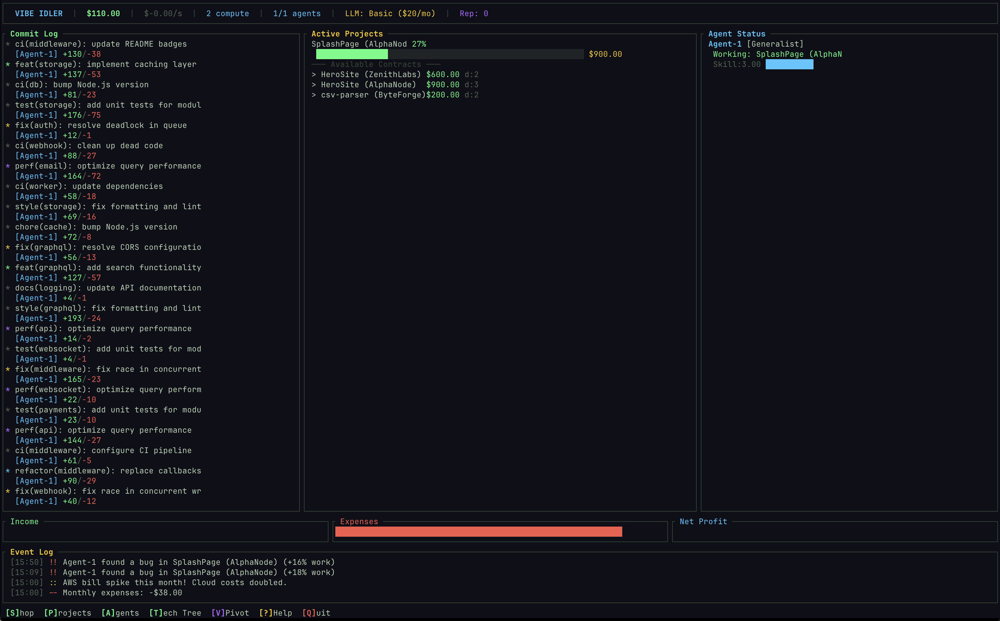

# Vibe Idler

A terminal-based idle game where you run a vibe coding consultancy. Hire AI agents, buy hardware, unlock better LLMs, and watch your empire of autonomously-generated software grow.

Built with Rust and [Ratatui](https://github.com/ratatui/ratatui).



## How to Play

1. **Buy hardware** in the Shop (`S`) to get compute power
2. **Hire AI agents** to work on projects automatically
3. **Accept contracts** for software projects that pay cash on completion
4. **Upgrade your LLM** to improve code quality and reduce bugs
5. **Pivot** (`V`) once you've earned enough to prestige-reset with permanent bonuses

Agents auto-assign to available contracts, grow their skills over time, and generate a stream of realistic-looking commits as they work.

## Game Systems

- **14 project types** from Landing Pages to Enterprise Software, unlocked progressively
- **8 hardware tiers** from Used Laptop to Data Center
- **6 LLM tiers** affecting code quality and bug rates
- **8 agent specializations** (Frontend, Backend, DevOps, Security, etc.) with skill growth
- **Prestige system** — pivot your consultancy to earn reputation and permanent multipliers
- **Recurring revenue** from SaaS and Open Source projects
- **Auto-save** every 60 seconds

## Install

### Pre-built binaries

Download the latest release for your platform from the [Releases page](https://github.com/areadenialgames/vibe-idler/releases).

Available for Linux (x86_64, aarch64), macOS (x86_64, Apple Silicon), and Windows (x86_64).

**macOS note:** After downloading, you may need to remove the quarantine attribute:
```sh
xattr -d com.apple.quarantine vibe-idler
```

### Build from source

Requires the [Rust toolchain](https://rustup.rs/).

```sh
git clone https://github.com/areadenialgames/vibe-idler.git
cd vibe-idler
cargo run --release
```

## Controls

| Key | Action |
|-----|--------|
| `S` | Open Shop (hardware, LLMs, agents) |
| `P` | View Projects |
| `A` | View Agents |
| `T` | Tech Tree |
| `V` | Pivot (prestige reset) |
| `?` | Help |
| `Q` | Quit |

**In menus:** `Tab`/arrows to switch tabs, `j`/`k` to navigate, `Enter` to buy, `Esc` to close.

## Save Data

Game state is saved to:
- **Linux:** `~/.local/share/vibe-idler/save.json`
- **macOS:** `~/Library/Application Support/vibe-idler/save.json`
- **Windows:** `%APPDATA%\vibe-idler\save.json`
